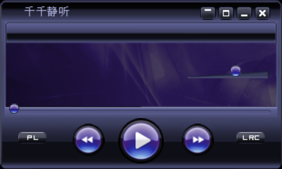
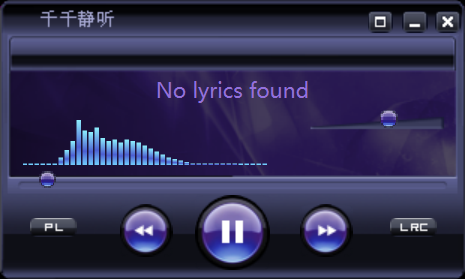
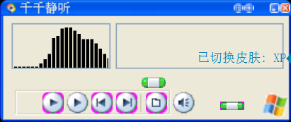
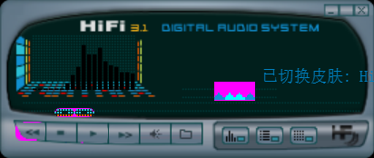
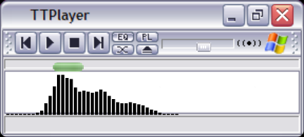
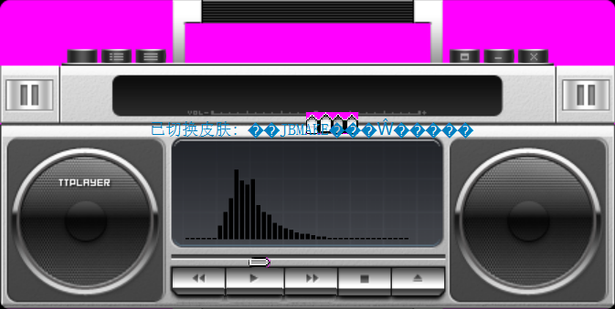
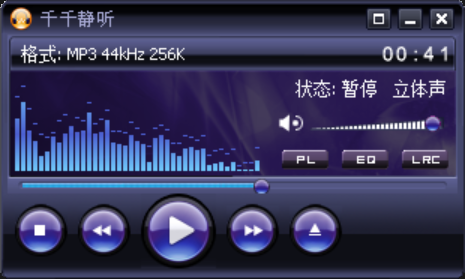

# TTPlayer (C++ Qt 6.10.3)

[English](#english) | [中文](#中文)



<a name="english"></a>
## English

### Introduction
TTPlayer is a lightweight music player developed with Qt 6 and C++. This project is a port of the original [TTPlayer](https://github.com/jthhpcqy/ttplayer) which was developed using PyQt5. The goal is to improve performance and provide a native application experience while maintaining the classic **千千静听** UI.

### Screenshots

#### Default Skin (Purple)


#### Skin Switching (Drag & Drop `.skn` file)
Supports loading original 千千静听 skin packages at runtime — simply drag any `.skn` file onto the player window:

| XP Style | HiFi 31 Digital | Classic Gray | Retro Radio |
|:---:|:---:|:---:|:---:|
|  |  |  |  |

> **Note**: The original 千千静听 UI for comparison:
>
> 

### Features
- Clean and modern UI (supports custom `.skn` skins via drag-and-drop)
- Playlist management with auto-loop
- Drag and drop support for adding music files (.mp3, .wav, .flac, .ogg, .m4a, .aac)
- Lyrics display (.lrc format) with fade animation
- **Real-time audio spectrum visualization** — 41-bar log-frequency spectrum with A-weighting, spatial smoothing, EMA temporal smoothing, and peak indicators
- Volume control
- Keyboard shortcuts for playback control
- Window opacity animation effects
- Progress bar seeking with synchronized spectrum position

### Known Issues / TODO
- **Text overflow on some skins**: When using certain skins (e.g., the Radio skin in screenshot `t7.png`), status text such as *"已切换皮肤：..."* can exceed the visible area and get clipped or garbled. This is because label geometry is currently hardcoded for the default Purple skin layout; dynamic skin-aware label sizing has not yet been implemented.
- Further UI adaptation work needed: button alignment, font scaling, and element positioning vary across different skin packages.

### Requirements
- Qt 6.x (tested with Qt 6.10.3)
- CMake 3.16 or higher
- MinGW or MSVC compiler with C++17 support
- Qt Multimedia module (for QMediaPlayer backend)

### Building from Source
```bash
# Clone the repository
git clone https://github.com/HPC2H2/ttplayer-cpp.git
cd ttplayer-cpp

# Build using the provided batch file
_rebuild.bat
```

Or manually:
```bash
# Create build directory
mkdir build && cd build

# Configure and build
cmake .. -G Ninja
ninja
```

### Usage
After building, run `build/TTPlayer.exe`. Drag MP3 files onto the player window to start playing, or drag `.skn` skin files to change the appearance.

#### Keyboard Shortcuts
| Key | Action |
|-----|--------|
| Space | Play / Pause |
| Up Arrow | Increase volume (+15%) |
| Down Arrow | Decrease volume (-15%) |

### Architecture
```
┌──────────────┐     ┌───────────────┐     ┌────────────────┐
│  QMediaPlayer │────▶│  MP3Decoder   │────▶│  SpectrumBars   │
│  (Qt Audio)   │     │  (minimp3)    │     │  (FFT + Render) │
└──────────────┘     └───────┬───────┘     └───────┬────────┘
                             │                     │
                      raw PCM decode          Visual output
                             │                     │
                      ┌──────▼──────┐     ┌──────▼────────┐
                      │ Custom FFT   │     │ 41 bars, A-weight│
                      │ (fft.h,1024pt)│     │ EMA, peaks    │
                      └─────────────┘     └───────────────┘
```
- **MP3Decoder**: Background thread decoding MP3 via [minimp3](https://github.com/lieff/minimp3), computes FFT spectrum in real-time
- **SpectrumBars**: Receives raw FFT data through callback, applies full AudioSpectrum-style processing pipeline:
  1. Log-frequency band mapping (20 Hz – 20 kHz → 41 bars)
  2. FFT normalization + A-weighting perceptual compensation
  3. Gain amplification
  4. Spatial convolution smoothing (kernel `[1,2,3,5,3,2,1]`)
  5. EMA temporal smoothing (α=0.55) + peak decay indicators
- **SkinEngine**: Parses `.skn` skin packages (BMP images + XML config), supports dynamic skin switching at runtime via drag-and-drop. Falls back to built-in Purple default skin when no external skin is loaded.
- **PlayList**: Manages playback queue, handles auto-loop (next song on EndOfMedia)

### About This Project
This project is a learning exercise that recreates the interface and functionality of the classic Chinese music player "千千静听" (TTPlayer) using modern technologies. The original TTPlayer was developed by Zheng Nanling.

This C++ version is a port of the Python implementation by [jthhpcqy](https://github.com/jthhpcqy/ttplayer).

### Disclaimer
All copyrights belong to the original authors. This project is for educational purposes only.

### Acknowledgements
- Original TTPlayer (千千静听) by Zheng Nanling
- Python implementation [TTPlayer](https://github.com/jthhpcqy/ttplayer) by jthhpcqy
- Qt framework
- [MiniMP3](https://github.com/lieff/minimp3) - Lightweight MP3 decoder
- [AudioSpectrum](https://github.com/potato04/AudioSpectrum) - Spectrum visualization algorithm reference
- [Spectralizer](https://github.com/univrsal/spectralizer) - Spectrum processing reference

---

<a name="中文"></a>
## 中文

### 简介
TTPlayer 是一款使用 Qt 6 和 C++ 开发的轻量级音乐播放器。本项目是原始 [TTPlayer](https://github.com/jthhpcqy/ttplayer)（使用 PyQt5 开发）的 C++ 移植版本，在保持经典千千静听界面风格的同时提供原生性能体验。

### 截图展示

#### 默认皮肤（Purple）


#### 换肤功能（拖放 `.skn` 文件即可切换）
支持在运行时加载原版千千静听皮肤包 —— 将任意 `.skn` 文件拖放到播放器窗口即可：

| XP 风格 | HiFi 31 数字风 | 经典灰 | 复古收音机 |
|:---:|:---:|:---:|:---:|
|  |  |  |  |

> **附：原版千千静听界面对照**
>
> 

### 功能特点
- 简洁现代的 UI（支持拖放 `.skn` 皮肤文件动态换肤）
- 播放列表管理，支持自动循环播放
- 拖放添加音乐文件（.mp3、.wav、.flac、.ogg、.m4a、.aac）
- 歌词显示（.lrc 格式），带淡入淡出动画
- **实时频谱可视化** — 41 柱对数频率分布，A 计权感知加权，空间卷积平滑，EMA 帧间平滑，峰值指示器
- 音量控制滑块
- 键盘快捷键控制播放
- 进度条拖拽定位，频谱位置同步跟随
- 窗口透明度动画效果

### 已知问题 / 待改进
- **部分皮肤存在文字溢出**：在使用某些皮肤时（如截图 `t7.png` 的收音机皮肤），状态文字（如 *"已切换皮肤：..."*）可能超出可见区域，出现截断或乱码。这是因为当前标签几何尺寸为默认 Purple 皮肤硬编码，尚未实现根据不同皮肤包动态调整标签大小与位置的功能。
- 其他 UI 适配工作待完善：按钮对齐、字体缩放、元素布局在不同皮肤包间存在差异。

### 系统要求
- Qt 6.x（已测试 Qt 6.10.3）
- CMake 3.16 或更高版本
- 支持 C++17 的编译器（MinGW / MSVC）
- Qt Multimedia 模块（用于 QMediaPlayer 后端）

### 从源代码构建
```bash
# 克隆仓库
git clone https://github.com/HPC2H2/ttplayer-cpp.git
cd ttplayer-cpp

# 使用提供的批处理脚本构建
_rebuild.bat
```

或手动构建：
```bash
mkdir build && cd build
cmake .. -G Ninja
ninja
```

### 使用方法
构建完成后运行 `build\TTPlayer.exe`。将 MP3 文件拖放到窗口即可开始播放；将 `.skn` 皮肤文件拖放到窗口即可切换外观。

#### 键盘快捷键
| 按键 | 功能 |
|------|------|
| 空格键 | 播放 / 暂停 |
| 上箭头 | 音量 +15% |
| 下箭头 | 音量 -15% |

### 技术架构
```
┌──────────────┐     ┌───────────────┐     ┌────────────────┐
│  QMediaPlayer │────▶│  MP3Decoder   │────▶│  SpectrumBars   │
│  (Qt 音频后端) │     │  (minimp3解码) │     │  (FFT+渲染)    │
└──────────────┘     └───────┬───────┘     └───────┬────────┘
                             │                     │
                      原始PCM解码              可视化输出
                             │                     │
                      ┌──────▼──────┐     ┌──────▼────────┐
                      │ 自定义 FFT   │     │ 41柱,A计权    │
                      │ (fft.h,1024点)│     │ EMA平滑,峰值  │
                      └─────────────┘     └───────────────┘
```
- **MP3Decoder**：后台线程通过 [minimp3](https://github.com/lieff/minimp3) 解码 MP3，实时计算 FFT 频谱
- **SpectrumBars**：通过回调接收原始 FFT 数据，完整 AudioSpectrum 风格处理流水线：
  1. 对数频率映射（20 Hz ~ 20 kHz → 41 根柱子）
  2. FFT 归一化 + A 计权感知补偿（模拟人耳等响曲线）
  3. 增益放大
  4. 空间卷积平滑（核 `[1,2,3,5,3,2,1]`）
  5. EMA 时间平滑（α=0.55）+ 峰值衰减指示器
- **SkinEngine**：解析 `.skn` 皮肤包（BMP 图片 + XML 配置），运行时通过拖放动态换肤；无外部皮肤时回退内置 Purple 默认皮肤
- **PlayList**：管理播放队列，EndOfMedia 时自动切下一首

### 项目结构
```
ttplayer-cpp/
├── src/                  # 源代码
│   ├── mainwindow.cpp/h  # 主窗口（UI构建、换肤、拖放）
│   ├── spectrumbars.cpp/h # 频谱可视化（FFT + 渲染）
│   ├── mp3decoder.cpp/h   # MP3解码线程（minimp3）
│   ├── fft.h              # 自实现 FFT（1024点）
│   ├── playlist.cpp/h     # 播放列表管理
│   ├── skinengine.cpp/h   # 皮肤引擎（.skn 解析与加载）
│   ├── skinparser.cpp/h   # 皮肤 XML 配置解析
│   ├── imageslider.cpp/h  # 自定义图片滑块
│   └── fadinglabel.cpp/h  # 淡入淡出歌词标签
├── skin/                 # 内置默认 Purple 皮肤资源
├── Designer_ui/          # Qt Designer UI 文件
├── tools/                # 辅助工具脚本
├── 【千千静听 Skin】皮肤 ★/ # 原版千千静听皮肤包集合
├── CMakeLists.txt        # CMake 构建配置
└── _rebuild.bat          # 一键构建脚本
```

### 关于本项目

这个 C++ 版本是对 [jthhpcqy](https://github.com/jthhpcqy/ttplayer) 的 Python 实现的移植。

### 免责声明
所有版权归原作者所有。本项目仅供学习用途。

### 致谢
- 原始千千静听由郑南岭先生开发
- Python 版本 [TTPlayer](https://github.com/jthhpcqy/ttplayer) 由 jthhpcqy 开发
- Qt 框架
- [MiniMP3](https://github.com/lieff/minimp3) - 轻量级 MP3 解码库
- [AudioSpectrum](https://github.com/potato04/AudioSpectrum) - 频谱可视化算法参考
- [Spectralizer](https://github.com/univrsal/spectralizer) - 频谱处理参考

### 更新日志
- **2026-06-27**:
  - 频谱可视化完整重写（AudioSpectrum 风格算法：对数频率映射、A计权、空间/时间平滑）
  - 修复循环播放时频谱卡顿（sourceChanged 时停旧解码线程）
  - 替换 kissFFT 为自研 FFT 实现（fft.h, 1024 点）
  - 新增 SkinEngine：拖放 `.skn` 文件动态换肤，支持原版千千静听皮肤包
  - 修复按钮重复创建导致的 UI 异常与闪退（构造函数补全 nullptr 初始化 + 幂等保护）
  - UI 对齐原版千千静听（移除多余置顶按钮，右上角三按钮右移）
  - README 补充截图展示、项目结构、已知问题记录
- **2025-08-13**: 引入频谱显示功能，基于 minimp3 + kissFFT 实现 MP3 解码和 FFT 频谱分析
- **2025-08-xx**: 从 PyQt5 版本移植到 Qt 6.8.2 / C++17
