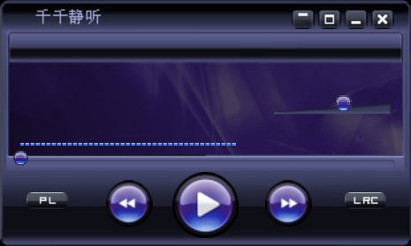

# TTPlayer (C++ Qt 6.8.2)

[English](#english) | [中文](#中文)



<a name="english"></a>
## English

### Introduction
TTPlayer is a lightweight music player developed with Qt 6.8.2 and C++. This project is a port of the original [TTPlayer](https://github.com/jthhpcqy/ttplayer) which was developed using PyQt5. The goal of this port is to improve performance and provide a native application experience while maintaining the same beautiful UI and functionality. Future enhancements will include more features.

### Features
- Clean and modern UI
- Playlist management
- Drag and drop support for adding music files
- Lyrics display
- Audio spectrum visualization (added 2025-08-13)
- Volume control
- Keyboard shortcuts for playback control
- Window opacity animation effects
- Always-on-top option

### Requirements
- Qt 6.8.2 or higher（Qt 5 compatibility is not tested）
- CMake 3.16 or higher
- C++17 compatible compiler

### Building from Source
```bash
# Clone the repository
git clone https://github.com/HPC2H2/ttplayer-cpp.git

# Build using the provided batch file
build.bat
```

Or manually:
```bash
# Create build directory
mkdir build && cd build

# Configure and build
cmake ..
cmake --build .
```

### Usage
After building, run the executable from the build directory:
```bash
# Navigate to the build directory
cd build

# Run the executable
TTPlayer.exe
```

#### Keyboard Shortcuts
- **Space**: Play/Pause
- **Up Arrow**: Increase volume
- **Down Arrow**: Decrease volume

### About This Project
This project is a learning exercise that recreates the interface and functionality of the classic Chinese music player "TTPlayer" (千千静听) using modern technologies. The original TTPlayer was developed by Zheng Nanling.

This C++ version is a port of the Python implementation by [jthhpcqy](https://github.com/jthhpcqy/ttplayer).

### Disclaimer
All copyrights belong to the original authors. This project is for educational purposes only.

### Acknowledgements
- Original TTPlayer (千千静听) by Zheng Nanling
- Python implementation [TTPlayer](https://github.com/jthhpcqy/ttplayer) by jthhpcqy
- Qt framework

---

<a name="中文"></a>
## 中文

### 简介
TTPlayer 是一款使用 Qt 6.8.2 和 C++ 开发的轻量级音乐播放器。本项目是原始 [TTPlayer](https://github.com/jthhpcqy/ttplayer)（使用 PyQt5 开发）的移植版本。此移植的目标是在保持相同美观界面和功能的同时，提高性能并提供原生应用程序体验。后续会增加功能。

### 功能特点
- 简洁现代的用户界面
- 播放列表管理
- 支持拖放添加音乐文件
- 歌词显示
- 音频频谱可视化（2025-08-13新增）
- 音量控制
- 播放控制的键盘快捷键
- 窗口透明度动画效果
- 窗口置顶选项

### 系统要求
- Qt 6.8.2 或更高版本(Qt 5 适配未经检验)
- CMake 3.16 或更高版本
- 支持 C++17 的编译器

### 从源代码构建
```bash
# 克隆仓库
git clone https://github.com/HPC2H2/ttplayer-cpp.git

# 使用提供的批处理文件构建
build.bat
```

或手动构建：
```bash
# 创建构建目录
mkdir build && cd build

# 配置并构建
cmake ..
cmake --build .
```

### 使用方法
构建完成后，从build目录运行可执行文件：
```bash
# 进入build目录
cd build

# 运行可执行文件
TTPlayer.exe
```

#### 键盘快捷键
- **空格键**：播放/暂停
- **上箭头**：增加音量
- **下箭头**：减少音量

### 关于本项目
本项目是一个学习练习，使用现代技术重新创建了经典中文音乐播放器"千千静听"的界面和功能。原始的千千静听由郑南岭先生开发。

这个C++版本是对[jthhpcqy](https://github.com/jthhpcqy/ttplayer)的Python实现的移植。

### 免责声明
所有版权归原作者所有。本项目仅供学习用途。

### 最近更新
- 2025-08-13：引入了频谱显示功能。后续将美化频谱的显示，增加MP3解码和MediaPlayer位置同步设计。

### 致谢
- 原始千千静听由郑南岭先生开发
- Python版本 [TTPlayer](https://github.com/jthhpcqy/ttplayer) 由 jthhpcqy 开发
- Qt 框架
- [MiniMP3](https://github.com/lieff/minimp3) - 轻量级MP3解码库
- [KissFFT](https://github.com/mborgerding/kissfft) - 快速傅里叶变换库
